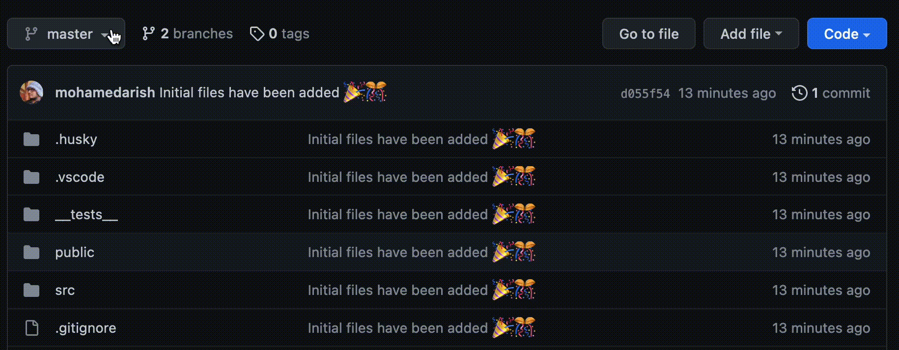

# Download these plugins for ease of working

- [prettier](https://marketplace.visualstudio.com/items?itemName=esbenp.prettier-vscode)

## Clone this repo and so the following

- check if there is a branch with your group/name in the repo



if it doesn't contact a maintainer and tell them about this issue.

- install all packages

```sh
    npm i --include=dev
```

- do the following command when doing the first push

```sh
    git checkout -b your-username
    git remote add origin https://github.com///tree/your-branch-name
```

```sh
    echo "[your name](your github profile link)" >> contributors.md
```

```sh
    npm run add
    git commit -m "initial push"
```

```sh
    git push --set-upstream origin {your username}
```

After you've completed all these steps you can continue to push updates normally after making changes with

```sh
    git push
```

as your origin is set to your branch now!!

don't forget to make a pull request after pushing the new changes
